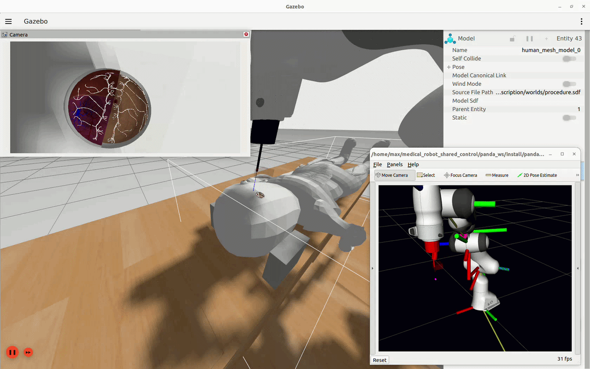
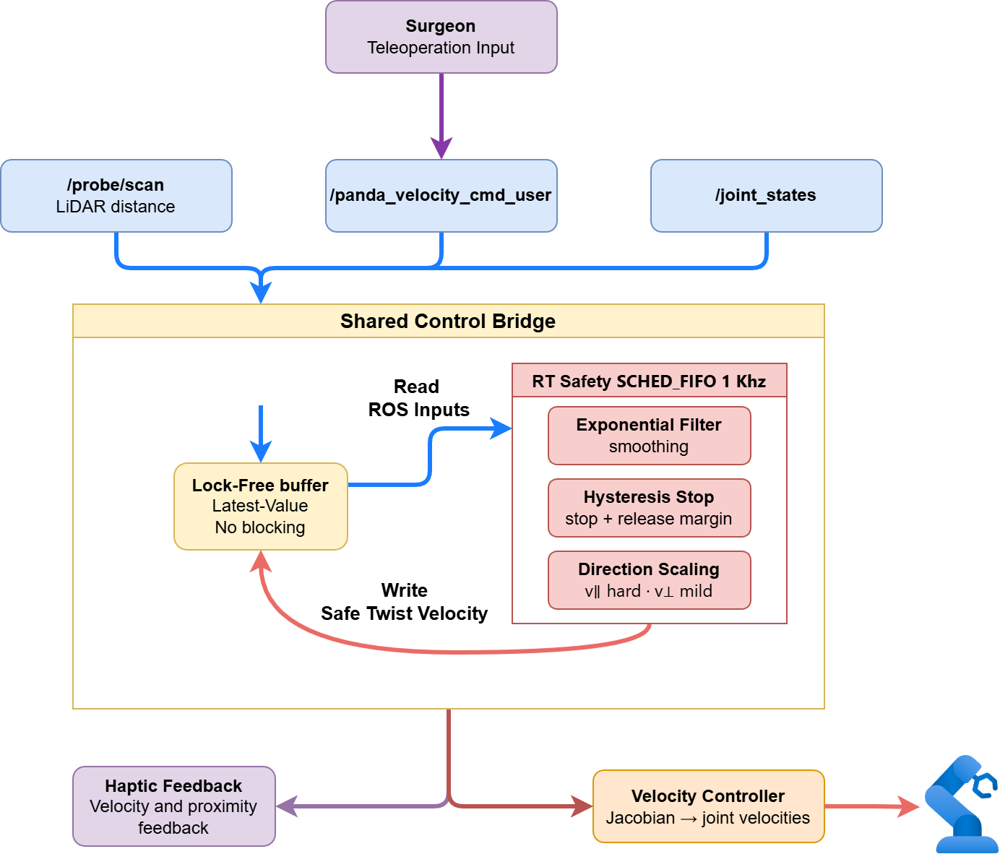

# Medical Shared Control for Surgical Robotics

This project implements a safety-critical shared-control module in modern C++ 
for simulated surgical robotics, using a Franka Emika Panda robot in ROS2/Gazebo.

Structure:
- panda_ws/src/safety_controller/: ROS-independent C++ RT safety core
- panda_ws/src/panda_controller/: ROS2 bridge + teleop + controllers
- panda_ws/: ROS2 workspace for simulation and integration

Goal:
Design and evaluate distance-based virtual safety constraints and shared control
for precise human-guided manipulation near delicate tissue.


## Docker Usage

Requirements:
- Docker Engine
- Docker Compose (v2)
- X11 display (for Gazebo/RViz)

Build the image:

```bash
docker build -t medical_shared .
```

Run with volumes via compose:

```bash
xhost +local:docker
docker compose up
```

Open a new terminal in the running container:

```bash
docker exec -it medical_robot_ros bash
```

Remember to source in each container terminal:

```bash
cd /workspaces/medical_robot_shared_control/panda_ws
source install/setup.bash
```

## Quick Start Commands

### Demo Launch (Gazebo + RViz camera + teleop)

```bash
# Terminal 1: Gazebo world with the human model
ros2 launch panda_description gazebo.launch.py world_file:=medical_procedure.sdf

# Terminal 2: Enable velocity control
ros2 launch panda_controller enable_velocity_control.launch.py

# Terminal 3: RViz camera feed
ros2 launch panda_description rviz_camera.launch.py

# Terminal 4: Teleop with haptic controller + safety bridge
ros2 launch panda_controller teleop.launch.py
```

This launches the simulation, the camera feed, and teleop so you can control
robot velocity with a haptic controller.

Safety control is enabled by default. Teleop publishes to a user command topic,
and the safety bridge generates the final velocity command.



LiDAR distance estimation:
A single-beam LiDAR mounted at the tool tip measures the line-of-sight distance
to tissue surfaces. The range reading is used as a real-time proxy for tool-to-
tissue separation and feeds the safety constraint logic that limits motion as
the tool approaches the tissue.

Real-time safety control (RT core):
- The safety controller runs in a dedicated C++ thread at 1 kHz.
- The RT loop avoids dynamic memory allocation and never waits on ROS.
- ROS nodes only exchange data via a lock-free latest-value buffer.
- The RT core outputs a safe velocity command based on LiDAR distance.
- A dead-man watchdog zeroes the output if the LiDAR or user-command stream
  goes stale (default 0.2 s), so a dropped input never replays the last motion.
- All safety thresholds are ROS parameters (`safety.stop_distance`,
  `safety.slow_distance`, `safety.max_linear_vel`, `safety.input_timeout_s`,
  ...) on the `shared_control_bridge`, and the output is saturated to absolute
  velocity limits.
- The pure safety law is unit-tested with gtest (`colcon test
  --packages-select safety_controller`).

Inverse kinematics:
- `panda_velocity_controller` resolves the full 7-DoF arm from a Cartesian
  twist using a damped-least-squares KDL solver (`ChainIkSolverVel_wdls`), so
  joint velocities stay bounded near singularities. Output joint velocities are
  additionally clamped to `max_joint_vel`.
- Teleop is 6-DoF: hold the orientation button to command roll/pitch/yaw with
  the sticks instead of translation.

## Architecture


Safety bridge topic mapping:
- Inputs: `/probe/scan`, `/panda_velocity_cmd_user`, `/joint_states`
- Output: `/panda_velocity_cmd`, `/haptic_feedback` 

Safety scaling behavior:
- The RT core scales motion toward the LiDAR beam direction more aggressively.
- Lateral motion is mildly slowed near obstacles for stability.
- Motion away from the obstacle is allowed with minimal slowdown.

Direction-aware slowdown:
The LiDAR beam defines a unit direction in the base frame. The controller
projects the commanded linear velocity onto this direction. Only the component
that moves toward the obstacle (positive projection) receives the strong
distance-based slowdown. Components that move away or laterally are kept at
full or mildly reduced speed. This prevents unnecessary slowdown when the
tool is retreating or sliding parallel to tissue.


## More Commands and Debugging

Extended command lists, troubleshooting notes, and teleop details are in
[docs/commands.md](docs/commands.md).

---
## Testing

The real-time safety core has a gtest unit suite (velocity scaling, stop
hysteresis, direction-aware slowdown, output clamping, watchdog zeroing, and
the lock-free buffer). GitHub Actions builds the workspace and runs the tests
on every push (see `.github/workflows/ci.yml`).

```bash
cd panda_ws
colcon build --packages-select safety_controller panda_description panda_controller
colcon test --packages-select safety_controller && colcon test-result --verbose
```

## Project Status
- ✅ Panda robot simulation in Gazebo
- ✅ ROS2 control integration
- ✅ Cartesian velocity control with KDL
- ✅ Full 7-DoF real-time inverse kinematics (damped least-squares)
- ✅ 6-DoF teleoperation (translation + orientation)
- ✅ Distance-based safety constraints with dead-man watchdog
- ✅ Controller reconnect with bounded retry
- ✅ Unit tests + CI for the safety core
- ⏳ Eyeball curvature-following (future work — see `to_do.txt`)